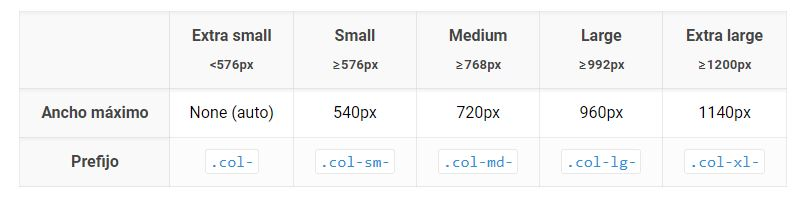

# Diseñando páginas web con Bootstrap 4 

- Idea inicial del proyecto : 
<a href='https://www.descubrimontevideo.uy/es/streetart'>https://www.descubrimontevideo.uy/es/streetart</a>

## Modulo 1

### Leccion 1 

<a href='https://getbootstrap.com/'>https://getbootstrap.com/</a>

### Configuracion de git 

- Creamos cuenta en Bitbucket :  
<a href='https://bitbucket.org/'>https://bitbucket.org/</a>

- Se ven algunos aspectos de la clonacion con SSH y HTTPS (mas directo y es un protocolo que por lo general esta siempre habilitado en las redes publicas) . 

- Creamos un app password porque no nos deja loguear con la contrasena de bitbucket para clonar el proyecto: **ATBBW94kckqfSrYcA3mafDWZ32XH82A846A9**

### Haciendo un pull desde bitbucket (otra forma de vincularlos)
~~~
- Creamos nueva carpeta : mkdir Nueva Carpeta 
- cd Nueva Carpeta 

- Agregamos direccion remota de bitbucket :
- git remote add origin urlRepositorioEnBitBucket

- Traemos el repositorio remoto al local especificando la branch :
-git pull origin master 
~~~

### Leccion 2

 Todo proyecto web está desarrollado por diferentes componentes que definen la arquitectura de la solución: 

-  Una arquitectura típica es servidor web como puede ser Apache, IIS o Node JS. Un lenguaje de programación de la lógica de negocio, también conocido como modelo de negocio. 

- Una tecnología de base de datos que nos permita persistir información, objetos o datos. 
 
 - Y una herramienta de desarrollo visual o presentación. Por ejemplo, Angular JS. 
 
 Cada uno de estos componentes son denominados capas. Así, podemos hablar de diferentes capas de acuerdo a su misión: capas de virtualización, de servidores, de modelos, de datos, de persistencia, de presentación, etcétera.
 
  A medida que avanzan las tecnologías, surgen nuevas herramientas que realizan tareas concretas y necesarias, dando lugar a una nueva capa, como podría ser, una capa de seguridad u orquestación. Por definición, la misión de la capa debe ser clara, con un único propósito e independiente de las otras capas. En la literatura, verás que mencionan las diferentes arquitecturas en base a las iniciales de cada capa. Una aclaración: usaremos indistintamente los términos arquitectura y Stack como sinónimos.
  
Si consideramos la evolución de las arquitecturas en los últimos años, vemos que por el 2005 se utilizaba LAMP: Linux, Apache, Mysql y PHP. Hoy en día, es muy popular el stack MEAN: Mongo, Express, Angular y Node. Pero si abrimos Mongo, tenemos como subcapas AWS, Amazon Web Services y HTML5 que nos permiten alojar nuestra base de datos y accederlas desde la web o vía servicios. 

Por sobre Express, nos encontramos con NGINX, que permite optimizar la velocidad de respuesta de consultas web y la descarga de contenido por parte del browser. Junto con el uso de Angular, debemos ocuparnos de la experiencia del usuario y utilizaremos Sass o Less para administrar los estilos de nuestras páginas. 

Como pueden ver, hace diez años, teníamos menos tecnologías, menos capas y tecnologías más sencillas. Hoy en día, eso está cada vez más complejizado y tenemos especialistas en cada una de estas capas. 

**Entonces, ¿qué entendemos por desarrollo Full Stack? Entendemos por desarrollador Full Stack, a una persona que trabaja con todas las tecnologías necesarias para desarrollar un proyecto, incluyendo todas sus capas y, por supuesto, la puesta en producción para que los usuarios finales lo utilicen**.

 ¿Qué sucede en el mercado? La polifuncionalidad de un programador Full Stack, abre debate sobre el grado de productividad y profesionalismo de una entrega, comparándolo con un equipo de especialistas. Otro debate en torno a esta figura, es sobre el expertise generalista versus el especialista. En la industria del software hay defensores de ambas líneas de pensamiento. Para citar un ejemplo, cuando comenzó a desarrollarse una de las grandes redes sociales de la actualidad, sólo buscaban programadores full stack. Algo similar, ocurre, actualmente, con las startups o emprendimientos tanto dentro de compañías establecidas -lo que se conoce como entrepreneurship-, como por fuera. Sin embargo, en productos maduros o con necesidades de negocio muy concretas, que requieren conocimiento particular de una tecnología o técnica, se suelen buscar perfiles de especialistas.
 
  Por otro lado, la forma de gestionar los proyectos tecnológicos de las empresas, puede favorecer o no a los perfiles Full Stack. Paradigmas de gestión del estilo Agile, probablemente, vean con buenos ojos la múltiple competencia debido a que puede y entiende las diferentes áreas del proyecto y puede aportar, dependiendo de su experiencia, sinergia con todo el equipo. Este perfil suele tener una visión más global de la solución y logra integrar con facilidad las diferentes áreas de trabajo. Lo habitual es que uno no sea bueno en todo y tenga puntos fuertes, puntos que les cuesta un poco más. Y esos puntos fuertes, son los que van a permitir que contribuyas mejor al desarrollo del proyecto. Probablemente, esos puntos donde te sientas más cómodo, sean los que permitan desarrollarte más adelante a futuro y sean los que más te agraden. 
  
  Entonces, ¿cuál es la diferencia clave de los programadores Full Stack? La gran ventaja de los programadores Full Stack, es que pueden comenzar y finalizar proyectos por sí mismos. Por lo tanto, son oro para cualquier emprendimiento, dado que es mucho más económico contar con un full stack que con dos o más programadores. 
  
  Por económico me refiero a dos aspectos: monetario, que es evidente y por otro lado temporal, que implica lograr un beta de proyecto o prueba de concepto en un tiempo muy breve, comparando con un equipo tradicional. Y en cuanto a lo formativo, ciertamente, es un buen punto de partida para ingresar al mundo de la programación y comenzar tus proyectos personales o una nueva empresa. Hay gran demanda de programadores en el mercado y los perfiles Full Stack son muy solicitados. Conocer las diferentes capas de desarrollo y sus necesidades, te abrirán un mundo nuevo donde podrás descubrir qué es lo que más te interesa y tendrás herramientas para avanzar por tu cuenta sólidamente.

### Leccion 3 (Comenzando un proyecto)

- Git - VCS - sistema de control de versiones 

- NodeJS + npm : Javascript del lado servidor (el motor de javascript se llama V8 y es el que utiliza chrome y nodeJS ). 

 Configuracion del servidor : 

- en la carpeta del proyecto **npm init** para crear un proyecto nodejs (crea el package.json)

- podemos agregar informacion como el nombre del servidor , el punto de inicio (en este caso el index.html), el repositorio de git 

- En nuestro caso vamos a usar un servidor ya preparado de npm **lite-server**

<a href='https://www.npmjs.com/package/lite-server'>https://www.npmjs.com/package/lite-server</a>

- Básicamente la idea principal que tiene que dar este servidor es esta, que funciona como router, utiliza fuertemente BrowserSync que es otra librería y digamos que es un tipo de servidor que está muy orientado a ser los single page apps, estas aplicaciones que funcionan con una página única como servidor web

- **BrowserSync** : Es una librería que lo que hace básicamente es escuchar los cambios que suceden en nuestro proyecto, en los archivos que tenemos en nuestro proyecto, en las páginas web, css, etcétera y recargar la página asociada al que esté ejecutando nuestro browser sobre nuestro servidor

- **lite server** en modo resumen se lleva muy bien con Angular, nos agiliza bastante lo que es el trabajo con las páginas web, ya que funciona con BrowserSync.

~~~
npm install lite-server --save-dev
~~~

- Luego agregamos el script y lo probamos : 

~~~
  "scripts": {
    "test": "echo \"Error: no test specified\" && exit 1",
    "dev": "lite-server"
  },
~~~

~~~
npm run dev
~~~

- Definicion del .gitignore
- Creacion del index.html 

### Leccion 4 (Introduccion a Boostrap4)

- **Instalacion de Boostrap** 

~~~
npm i bootstrap@5.2.0
~~~

- Aparentemente no es necesario instalar **jquery ni popper.js**.

- Configuramos el index.html para que incluya referencias a boostrap y a los archivos js 

<a href='https://getbootstrap.com/docs/5.2/getting-started/introduction/'>https://getbootstrap.com/docs/5.2/getting-started/introduction/</a>

- Incluimos el CSS y el Javascript de Boostrap como referencias externas en los script (referencias via CDN) : 

~~~
<!DOCTYPE html>
<html>
<head>
    <meta charset="UTF-8">
    <meta name="viewport" content="width=device-width, initial-scale=1">

    <title>Titulo</title>
    <!--Boostrap CSS -->
    <link href="https://cdn.jsdelivr.net/npm/bootstrap@5.2.0/dist/css/bootstrap.min.css" rel="stylesheet" integrity="sha384-gH2yIJqKdNHPEq0n4Mqa/HGKIhSkIHeL5AyhkYV8i59U5AR6csBvApHHNl/vI1Bx" crossorigin="anonymous">
    
</head>

<body>

<!--Boostrap JS -->
    
</body>
</html>
~~~

- Tambien se puede hacer referencia en los script directamente a los archivos alojados en el node_modules : 

~~~
<!DOCTYPE html>
<html>
<head>
    <meta charset="UTF-8">
    <meta name="viewport" content="width=device-width, initial-scale=1">

    <title>Titulo</title>
    <!--Boostrap CSS o SCSS -->
    <link  href="./node_modules/bootstrap/dist/css/bootstrap.min.css" rel='stylesheet'>

</head>

<body>
<!--Jquery y Popper ?-->
<!--Boostrap JS -->
    

</body>
</html>
~~~

- **Frameworks de frontend**

-  la práctica habitual en proyectos corporativos, es tomar un framework de base y, luego, personalizarlo de acuerdo a las necesidades del negocio

- si bien, en la actualidad todos los navegadores siguen ciertos estándares para facilitarles la vida a los programadores, algunos todavía tienen particularidades que hacen que ciertos componentes no funcionen como se espera

-  los cinco frameworks más populares de hoy en día: Bootstrap, Foundation, Semantic UI, Pure y UIKit

-  Los cinco del listado, cuentan con características similares, pero varían en los preprocesadores que utilizan y, por supuesto, en los componentes propuestos

-  Bootstrap, es el número uno en popularidad y es el que utilizaremos en este curso. Hay infinidad de proyectos que lo utilizan y cuentan con una gran variedad de templates o versiones personalizadas, que se adaptan a diferentes tipos de proyecto. **Utiliza como preprocesador, por defecto, Sass**(ya veremos lo que son los procesadores), y sus componentes son Responsive, es decir, se adaptan al tamaño de los celulares y tabletas.

### Leccion 5 (Diseño responsive y sistema de grillas en Boostrap)

- **Diseño Responsive** :

- Aquí hablamos de desarrollar una web que se adapte al formato del dispositivo en que se ve, tanto si es una tableta Apple o Android o un celular Apple o Android de cualquier fabricante o una computadora de escritorio. Es necesario que sea así porque deseamos darle una experiencia agradable a nuestro usuario más allá de que sea utilizable nuestro sitio.

- Buscamos que un texto se vea con un tamaño mayor en una pantalla pequeña y que escale proporcionalmente en una pantalla más grande. Buscamos que una imagen se vea proporcionalmente al dispositivo y que se adapte al contexto donde se muestra.

- Buscamos contenedores de texto e imágenes flexibles para que se modifiquen de acuerdo a nuestras necesidades. Para ello, debemos podemos indicarle al navegador qué tamaño de fuentes, de imágenes de elementos utilizar de acuerdo al dispositivo.

- **Idealmente, buscamos que nuestro contenido se adapte proporcionalmente al tamaño de la pantalla. ¿Dónde definimos esto? Ciertamente va a ser en la sección de estilos, en los CSS.**

- W3C creó el CSS3 incorpora los **media query** mejorando notablemente los media type. Los media query **permiten escribir cláusulas lógicas en el atributo media para especificar el criterio de aplicación del CSS**.

- ## **Sistema de grillas (Flexbox) :**

-  Flexbox nos permite gestionar la visualización de nuestra página web y el esquema de disposición de los elementos que utilizaremos. Nos permite gestionar el espacio y ubicar los elementos utilizando un sistema de una única dimensión. Este sistema de una única dimensión permite disponer, con sencillez y facilidad, los elementos que utilizaremos. Y esto se contrasta fuertemente con el sistema bidimensional de CCS grid.

 ### **Flex-direction** :

- El **eje principal**, definido con el atributo **flex-direction**, puede estar en cuatro direcciones, row, row-reverse, column y column-reverse. 

- Row y row-reverse se utilizan para disponer los elementos en línea, ubicándolos de izquierda a derecha, en el caso de row, y de derecha a izquierda si es row-reverse.
- Column y column-reverse se utilizan para disponer los elementos verticalmente, ubicándolos de arriba hacia abajo, en el caso de column, y de abajo hacia arriba si es column-reverse. 

- El eje perpendicular, o cross-axis, como su nombre lo indica, varía de forma perpendicular al eje principal. 

 ### **container o  display : flex** :
- Otro concepto importante es el de container. Un área del documento que utilice flexbox, se llama flex container.

- **Para crear un container, utilizaremos la propiedad display con el valor flex o inline-flex**.

- Se muestran los ítems en fila. Flex-direction es row. Se comienza a la izquierda o desde arriba, dependiendo del eje principal. Los ítems no se agrandan a lo largo del eje principal, pero podrían achicarse.

- Los ítems se disponen a llenar toda la longitud del eje perpendicular. La propiedad flex-basis es auto, la propiedad flex-wrap es nowrap. 

 **boostrap tiene nombres reservados para las clases :**

- ### **Contenedores :**

- **class = "container"** : Los containers proveen el centrado de sus elementos y ubican horizontalmente su contenido.
Tenemos dos tipos de containers. 

- **container**, que brinda un ancho responsive; 

- **container-fluid**, que configura el ancho en 100% para todos los dispositivos.

- ### **Filas :**

- **class = "row"**: las row contienen columnas que las ubican horizontalmente. Cada columna presenta un padding horizontal para controlar la separación entre ellas. **Es importante respetar, para el sistema de grillas, que las rows contengan siempre columnas y las columnas estén siempre dentro de una row**. Si no especificamos el ancho de las columnas, cada una de ellas ocupará el espacio proporcionalmente, de acuerdo a la cantidad de columnas. 

- ### **Columnas :**

<a href='https://getbootstrap.esdocu.com/docs/5.1/layout/columns/'>https://getbootstrap.esdocu.com/docs/5.1/layout/columns/</a>

- Por default, Bootstrap maneja 12 columnas por filas.
- Tenemos otra alternativa para configurar el ancho de nuestras columnas utilizando las clases col-* , siendo asterisco la cantidad de columnas de uno a 12 que queremos ocupar.

- Bootstrap permite configurar cinco tipos de columna de forma responsive para mantener el sistema de grillas responsive. **Esos tipos de configuraciones se llaman responsive breakpoints**. Los responsive breakpoints no son más que diferentes tipos de **media queries** que se adaptan a determinado tipo de dispositivo.

- estos **responsive breakpoints y los containers
son las únicas clases que se definen en píxeles**. Todo el resto de los elementos utilizan **em y rem**

- Si simplemente queremos tamaño de ancho variable proporcionales a la pantalla, **no hace falta especificar nada** ,  utilizar la clase col es suficiente para la mayoría de los casos donde no nos interese diferenciar los anchos. 

- ### **Alineacion :**

- Básicamente, podemos distinguir tres opciones, al comienzo, al centro y al final.

- Con las clases **align-items**, podemos ubicar donde queramos a las filas dentro de una columna.

- Con las clases **align-self**, podemos ubicar donde queramos a las columnas dentro de una fila.

- ### **Compensacion de columnas :**

- Puedes compensar las columnas de la cuadrícula de dos maneras: nuestras clases responsive de cuadrícula .offset- y nuestras utilidades de margen. Las clases de cuadrícula se dimensionan para que coincidan con las columnas, mientras que los márgenes son más útiles para diseños rápidos donde el ancho del desplazamiento es variable.

### **Utilizando Flex** : 

- Declaramos un contenedor con la clase **d-flex** , en este caso a los **row** (cambiamos la clase row por la clase d-flex)

- Para que las columnas no salgan del contenedor podemos declararle la clase **flex-wrap** al row . 

- 

- 

