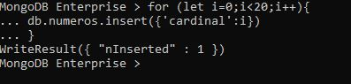

# Curso mongoDB udemy

MongoDB almacena datos en documentos similares a JSON, lo que hace que la base de
datos sea muy flexible y escalable.

## Introduccion a mongoDB : CRUD
----------------------------------------------
- En principio luego de la instalacion debemos modificar las variables de ambiente para poder ejecutar la consola de mongo desde cualquier carpeta . 
- <a href='https://www.udemy.com/course/aprende-mongodb-desde-cero/learn/lecture/15737242#questions/14286900'>Ver video </a>

- Nuestra carpeta de trabajo sera **data** y dentro de ella tendremos nuestra carpeta **db** 

- Primero lanzanmos el demonio de mongo desde data con el comando **mongod**, luego lanzamos la consola de mongo desde data con el comando **mongo**. 

- Si hacemos algun insert podremos ver el resultado mediante Robo3T en la **collection** llamada **test** 
--------------------------------------------------------
~~~
CRUD (Create-Read-Update-Delete)
~~~

- Create (**insert( )**)
- Read (**find( )**)
- Update (**update( )**)
- Delete (**remove( )**)

Los tres ultimos llevan como parametro un query 

### **Consola de mongo(COMANDOS)** 

|Comando |  Accion|
|------------|-----------------|
|db |nos muestra la base de datos actual donde estamos trabajando|
|show dbs|nos muestra un listado de las bases|
|use nombreBase|crea nueva base, solo aparece cuando le damos contenido|
|db.nombreColleccion.**insert**(elemento)|crea nueva coleccion en la base actual (**CREATE**)|
|show collections|muestra collecciones en la base actual|
|------------|-----------------|
|db.nombreCollection.**count()**|nos da el numero de elementos de la collection|
|db.nombreCollection.**find**({"clave": valor})|nos devuelve el registro "clave": valor (**READ**)|
|db.nombreCollection.**find().pretty()**|nos da una salida mas elegante de json|
|consulta.**explain()**|nos da mucha info sobre dicho registro|
|consulta.explain("executionStats")|nos da mas info sobre la consulta|
|db.nombreCollection.**createIndex**({"clave": numero})|crea indice en la coleccion|
|------------|-----------------|
|**mongoimport** --db nameBase --collection nameCollection --jsonArray --file usuarios.json|importamos el archivo usuarios.json|
|------------|-----------------|
|db.nombreCollection.**update**( {query} , {$**set** :{ data }} )|modifica query con data (**UPDATE**)|
|db.nombreCollection.**remove**( {query} )|remueve registro**s** correspondiente a la query (**DELETE**)|
|------------|-----------------|

- En nuestra jerarquia tenemos : 
~~~
 Base de datos  -> Coleccion -> Documento/Registro

 Query == consulta 
~~~
 - No tenemos que definir la estructura de la coleccion . 

- **Podemos usar JS en la consola de mongo** , por ejemplo ejecutar bucles con instrucciones de incercion en la base : 

- Crear indices para las busquedas las hace mas rapidas (**createIndex( )**)

##  Importar datos a mongo

- Instalamos el paquete data base tools de 
<a href='https://www.mongodb.com/try/download/database-tools'>Link</a>
- Descomprimimos la carpeta en **C:\Program Files\MongoDB\Server**
- Agregamos **C:\Program Files\MongoDB\Server\mongodb-database-tools-windows-x86_64-100.5.2\bin** como variable de entorno de windows. 

### Importacion de un jsonArray :
~~~
**mongoimport** --db nameBase --collection nameCollection --jsonArray --file usuarios.json
~~~
- importamos el archivo usuarios.json a la coleccion nameCollection , si la coleccion no existe es creada . 
- en este caso nuestro archivo .json esta alojado en la carpeta **data**

## Modificar y borrar registros (Update-Delete)

### Update :
Utilizamos la sintaxis : 

~~~
db.nombreCollection.update( {query} , {$set :{ data }} ) 
~~~

**donde query es la especificacion de los registros y data son los datos nuevos a registrar** 

por ejemplo : 
~~~
db.nombreCollection.update( {'nombre':'Pablo'} , {$set:{ 'nombre':'Pablo Nuevo' }} ) 
~~~

**esto nos cambia un solo registro de nuestra coleccion**

### Delete :
Utilizamos la sintaxis : 

~~~
db.nombreCollection.remove( {query} )
~~~

esto nos borrara **todos** los registros que coincidan con la query 

## Agregar campos a un documento/registro 

### Operadores para usar con update :

- Con el operador **$set** podemos añadir un campo al documento.
 - Con el operador **$inc** podemos incrementar o decrementar un campo
numérico.
- **upsert** (boolean Opcional). Si se establece en verdadero, crea un nuevo
documento cuando ningún documento coincide con los criterios de
consulta. El valor predeterminado es falso, que no inserta un nuevo
documento cuando no se encuentra ninguna coincidencia.
- **multi** (booleano Opcional). Si se establece en verdadero, actualiza varios
documentos que cumplen con los criterios de consulta. Si se establece en
falso, actualiza un documento. El valor predeterminado es falso.

por ejemplo con : 

~~~
db.usuarios.update({},{$inc:{'edad':-2}},false,true)
~~~

- restamos 2 al campo edad de todos los registros 
- upsert = false , no se crea el campo si no existe 
- multi = true , se actualizan todos los documentos que cumplen con el criterio de consulta

## Herramientas 

- Para edicion de jSON :

<a src='https://jsoneditoronline.org/'>https://jsoneditoronline.org/</a>

- Para validacion de jSON : 

<a src='https://jsonlint.com/'>https://jsonlint.com/</a>

