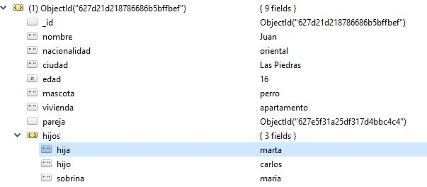
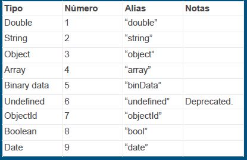
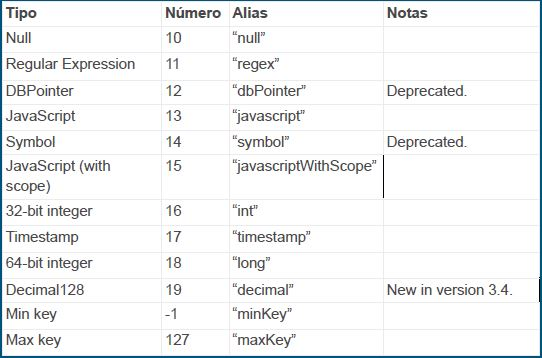

# Curso mongoDB udemy

MongoDB almacena datos en documentos similares a JSON, lo que hace que la base de
datos sea muy flexible y escalable.

## Introduccion a mongoDB : CRUD (SECCION 2)
----------------------------------------------
- En principio luego de la instalacion debemos modificar las variables de ambiente para poder ejecutar la consola de mongo desde cualquier carpeta . 
- <a href='https://www.udemy.com/course/aprende-mongodb-desde-cero/learn/lecture/15737242#questions/14286900'>Ver video </a>

- Nuestra carpeta de trabajo sera **data** y dentro de ella tendremos nuestra carpeta **db** 

- Primero lanzanmos el demonio de mongo desde data con el comando **mongod**, luego lanzamos la consola de mongo desde data con el comando **mongo**. 

- Si hacemos algun insert podremos ver el resultado mediante Robo3T en la **collection** llamada **test** 
--------------------------------------------------------
~~~
CRUD (Create-Read-Update-Delete)
~~~

- Create (**insert( )**)
- Read (**find( )**)
- Update (**update( )**)
- Delete (**remove( )**)

Los tres ultimos llevan como parametro un query 

### **Consola de mongo(COMANDOS)** 

|Comando |  Accion|
|------------|-----------------|
|db |nos muestra la base de datos actual donde estamos trabajando|
|show dbs|nos muestra un listado de las bases|
|use nombreBase|crea nueva base, solo aparece cuando le damos contenido|
|db.nombreColleccion.**insert**(elemento)|crea nueva coleccion en la base actual (**CREATE**)|
|show collections|muestra collecciones en la base actual|
|------------|-----------------|
|db.nombreCollection.**count()**|nos da el numero de elementos de la collection|
|db.nombreCollection.**find**({"clave": valor})|nos devuelve el registro "clave": valor (**READ**)|
|db.nombreCollection.**find().pretty()**|nos da una salida mas elegante de json|
|db.nombreCollection.**find({},{"nombreCampo":1})**|trae todos los id y **solo** los nombreCampo de los registros|
|db.nombreCollection.**find({},{"nombreCampo":0})**|trae todos los campos que no sean nombreCampo|
|db.nombreCollection.find().**sort({"campo":-1})**|ordena busqueda de manera descendente segun 'campo' (con 1 es ascendente)|
|db.nombreCollection.find().**limit(number)**|limita consulta a number elementos|
|db.nombreCollection.find().**sort(number)**|saltea number elementos en la busqueda|
|db.nombreCollection.**count({query}**)|cuenta numero de registros con query caracteristica|
|db.nombreCollection.find({'campo' :  {**$exists:true**}})|devuelve registros que tengan 'campo'|
|------------|-----------------|
|------------|-----------------|
|------------|-----------------|
|------------|-----------------|
|consulta.**explain()**|nos da mucha info sobre dicho registro|
|consulta.**explain("executionStats")**|nos da mas info sobre la consulta|
|db.nombreCollection.**createIndex**({"clave": numero})|crea indice en la coleccion|
|------------|-----------------|
|**mongoimport** --db nameBase --collection nameCollection --jsonArray --file usuarios.json|importamos el archivo usuarios.json|
|------------|-----------------|
|db.nombreCollection.**update**( {query} , {$**set** :{ data }} )|modifica query con data (**UPDATE**)|
|db.nombreCollection.**remove**( {query} )|remueve registro**s** correspondiente a la query (**DELETE**)|
|------------|-----------------|
|**Operadores de consulta ($)**||
|**Selectores de consulta**||
|**$ eq** |Coincide con valores que son iguales a un valor especificado.|
|**$ gte** |Coincide con valores mayores o iguales que un valor especificado.|
|**$ gt**| Coincide con valores que son mayores que un valor especificado.|
|**$ in** |Coincide con cualquiera de los valores especificados en una matriz.|
|**$ lt** |Coincide con valores inferiores a un valor especificado.|
|**$ lte**| Coincide con valores menores o iguales a un valor especificado|
|**$ ne**|Coincide con todos los valores que no son iguales a un valor especificado|
|**$ nin**|No coincide con ninguno de los valores especificados en un arreglo.|
|**Operadores Logicos**||
|**$and**|una cláusulas de consulta con un AND lógico que devuelve todos los documentos que coinciden con las condiciones de ambas cláusulas|
|**$not** |Invierte el efecto de una expresión de consulta y devuelve documentos que no coinciden con la expresión de consulta.|
|**$nor**|Las cláusulas de consulta con un NOR lógico devuelve todos los documentos que no coinciden con ambas cláusulas|
| **$or** |una cláusula de consulta con un OR lógico devuelve todos los documentos que coinciden con las condiciones de cualquiera de las cláusulas|
|------------|-----------------|
|------------|-----------------|

- En nuestra jerarquia tenemos : 
~~~
 Base de datos  -> Coleccion -> Documento/Registro

 Query == consulta 
~~~
 - No tenemos que definir la estructura de la coleccion . 

- **Podemos usar JS en la consola de mongo** , por ejemplo ejecutar bucles con instrucciones de incercion en la base : 

- Crear indices para las busquedas las hace mas rapidas (**createIndex( )**)

##  Importar datos a mongo

- Instalamos el paquete data base tools de 
<a href='https://www.mongodb.com/try/download/database-tools'>Link</a>
- Descomprimimos la carpeta en **C:\Program Files\MongoDB\Server**
- Agregamos **C:\Program Files\MongoDB\Server\mongodb-database-tools-windows-x86_64-100.5.2\bin** como variable de entorno de windows. 

### Importacion de un jsonArray :
~~~
**mongoimport** --db nameBase --collection nameCollection --jsonArray --file usuarios.json
~~~
- importamos el archivo usuarios.json a la coleccion nameCollection , si la coleccion no existe es creada . 
- en este caso nuestro archivo .json esta alojado en la carpeta **data**

## Modificar y borrar registros (Update-Delete)

### Update :
Utilizamos la sintaxis : 

~~~
db.nombreCollection.update( {query} , {$set :{ data }} ) 
~~~

**donde query es la especificacion de los registros y data son los datos nuevos a registrar** 

por ejemplo : 
~~~
db.nombreCollection.update( {'nombre':'Pablo'} , {$set:{ 'nombre':'Pablo Nuevo' }} ) 
~~~

**esto nos cambia un solo registro de nuestra coleccion**

### Delete :
Utilizamos la sintaxis : 

~~~
db.nombreCollection.remove( {query} )
~~~

esto nos borrara **todos** los registros que coincidan con la query 

## Agregar campos a un documento/registro 

### Operadores para usar con update :

- Con el operador **$set** podemos añadir un campo al documento.
 - Con el operador **$inc** podemos incrementar o decrementar un campo
numérico.
- **upsert** (boolean Opcional). Si se establece en verdadero, crea un nuevo
documento cuando ningún documento coincide con los criterios de
consulta. El valor predeterminado es falso, que no inserta un nuevo
documento cuando no se encuentra ninguna coincidencia.
- **multi** (booleano Opcional). Si se establece en verdadero, actualiza varios
documentos que cumplen con los criterios de consulta. Si se establece en
falso, actualiza un documento. El valor predeterminado es falso.

por ejemplo con : 

~~~
db.usuarios.update({},{$inc:{'edad':-2}},false,true)
~~~

- restamos 2 al campo edad de todos los registros 
- upsert = false , no se crea el documento si no existe tal en los criterios de consulta
- multi = true , se actualizan todos los documentos que cumplen con el criterio de consulta

## Ordenar Consultas 

-  Podemos **seleccionar ciertos campos** en nuestras consultas, indicándolo
como **1 para visualizarlo o cero para no visualizarlo**.

por ejemplo :
~~~
db.usuarios.find({},{"nombre":1})
~~~
nos traera todos los _id y nombres de los documentos.
~~~
db.usuarios.find({},{"nombre":0})
~~~
nos traera todos los _id y el resto de los campos que **no son** nombre de los documentos.

- Podemos ordenar una consulta con **sort({campo:1})**, donde 1 es ascendente
y -1 descendente.
~~~
db.usuarios.find({},{"_id":0}).pretty().sort({"edad":-1})
~~~

- Podemos limitar la consulta con **limit(numero)**.
~~~
db.usuarios.find().limit(2)
~~~

- Podemos saltarnos los primeros elementos de una consulta con
skip(numero).
~~~
db.usuarios.find().limit(2).skip(1)
~~~

- Por medio de **count({condición}}** podemos contar los elementos de la base
de datos.
~~~
db.usuarios.find().count({"edad":0})
~~~
para contar numero de registros con edad = 0 

### Relacionar colecciones (se usa poco)

Se relacionan por medio del id 

~~~
db.usuarios.update({'nombre':'Juan'},{$set:{'pareja':ObjectId("627e5f31a25df317d4bbc4c4")}})
~~~

con esto creamos un nuevo campo (pareja) en el registro de nombre Juan que lo vincula a otro registro de otra coleccion (parejas) 

## Notacion de punto 
**La usamos para hacer referencia a un objeto dentro de otro objeto**
~~~
db.usuarios.update({'nombre':"Juan"},{$set:{"hijos":{"hija":"marta","hijo":"carlos","sobrina":"maria"}}},false,true)
~~~
con esto agregamos un nuevo campo (hijos) el objeto de la query , este nuevo campo es un objeto json con varios elementos

 

 

Ahora podemos realizar la busqueda :

~~~
db.usuarios.find({"hijos.sobrina":'maria'})

db.usuarios.count({"hijos.sobrina":'maria'})
~~~

## Cursor 

- Cuando la función **db.collection.find ()** se utiliza para buscar documentos en
la colección, el resultado **devuelve un puntero a la colección de documentos
devueltos**, que se denomina **cursor**.
- Por defecto, el cursor se iterará automáticamente cuando se devuelva el
resultado de la consulta. Pero también se puede revisar explícitamente los
elementos devueltos en el cursor uno por uno.

- **Solo se puede utilizar una vez**

- Creamos el puntero
~~~
var userPuntero = db.usuarios.find()
~~~

- Lo usamos en distintos ciclos con JS 

~~~
while(userPuntero.hasNext()){print(tojson(userPuntero.next()))}
~~~

## Operadores para consultas (SECCION 3)

### **Selectores de consulta** 

- **$ eq** Coincide con valores que son iguales a un valor especificado.
~~~
db.usuarios.find({"vivienda":{$eq:"apartamento"}}).pretty()
~~~
- **$ gt** Coincide con valores que son mayores que un valor especificado.
~~~
 db.usuarios.find({"edad":{$gt:150}}).pretty()
~~~
- **$ gte** Coincide con valores mayores o iguales que un valor especificado.
- **$ in** Coincide con cualquiera de los valores especificados en una matriz.
- **$ lt** Coincide con valores inferiores a un valor especificado.
~~~
db.usuarios.find({"edad":{$lt:10}}).pretty()
~~~
- **$ lte** Coincide con valores menores o iguales a un valor especificado.
- **$ ne** Coincide con todos los valores que no son iguales a un valor
especificado.
~~~
db.usuarios.find({"nombre":{$ne:"Juan"}}).pretty()
~~~
- **$ nin** No coincide con ninguno de los valores especificados en un arreglo.
~~~
db.usuarios.find({"nombre":{$nin:["Juan","Pedro"]}}).pretty()
~~~

### **Operadores Logicos** 

- **$and** una cláusulas de consulta con un AND lógico que devuelve todos los
documentos que coinciden con las condiciones de ambas cláusulas.
~~~
db.usuarios.find({$and:[{"nombre":"Juana"},{"mascota":"pez"}]}).pretty()
~~~
- **$not** Invierte el efecto de una expresión de consulta y devuelve documentos
que no coinciden con la expresión de consulta.
~~~
db.usuarios.find({'edad':{$not:{$eq:170}}}).pretty()

db.usuarios.find({'edad':{$not:{$gt:5}}}).pretty()
~~~
-  **$nor** Las cláusulas de consulta con un NOR lógico devuelve todos los
documentos que no coinciden con ambas cláusulas.
~~~
db.usuarios.find({$nor:[{"nombre":"Juana"},{"vivienda":"perro"}]}).pretty()
~~~
- **$or** una cláusula de consulta con un OR lógico devuelve todos los
documentos que coinciden con las condiciones de cualquiera de las
cláusulas.
~~~
db.usuarios.find({$or:[{"nombre":"Juana"},{"mascota":"perro"}]}).pretty()
~~~

 
### **Operadores elementos de consulta**

- **$exists** Coincide con documentos que tienen el campo especificado.
- **$type** Selecciona documentos si un campo es del tipo especificado.

 

 

 

-------------------------------------
## Herramientas 

- Para edicion de jSON :

<a src='https://jsoneditoronline.org/'>https://jsoneditoronline.org/</a>

- Para validacion de jSON : 

<a src='https://jsonlint.com/'>https://jsonlint.com/</a>

